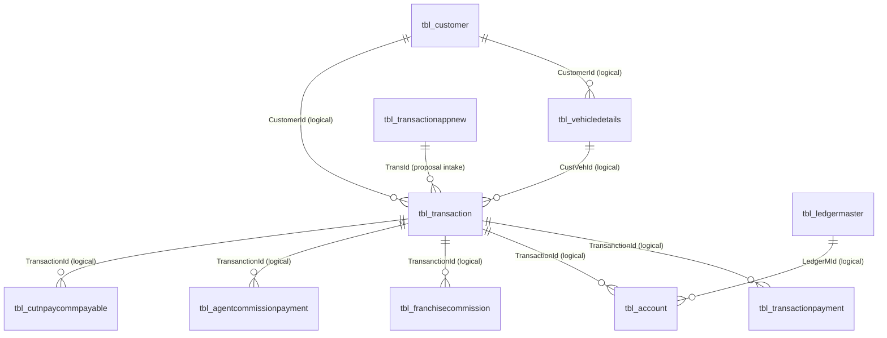

# Database Mapping Document — Phase 2

## 1. Overview
This document specifies the exact physical schema mapping, primary keys, legacy naming quirks, and logical relationships for the 10 verified core tables implemented during **Phase 2 (Database Models & Repositories)** of the Reliable Assurance backend migration.

Target Development Database: `reliable_insurance_dev`  
Target ORM: SQLAlchemy 2.0 Declarative Mapping (Async)  
Database Engine Options: `mysql_charset="utf8"`, `mysql_collate="utf8_general_ci"`, `mysql_row_format="DYNAMIC"`  
Physical Foreign Key Constraints: **0** (All referential integrity enforced strictly at the application layer)

---

## 2. Verified Table Catalog & Primary Keys

| # | SQLAlchemy Model | Physical Table Name | Physical PK Column | Total Columns | Logical Domain |
|---|---|---|---|---|---|
| 1 | `Customer` | `tbl_customer` | `CustomerId` | 38 | Policyholder / Retail Client Registry |
| 2 | `VehicleDetails` | `tbl_vehicledetails` | `CustVehId` | 32 | Insured Motor Asset Registry |
| 3 | `Transaction` | `tbl_transaction` | `TransanctionId` | 166 | Primary Policy & Financial Transaction Master |
| 4 | `TransactionAppNew` | `tbl_transactionappnew` | `TransId` | 116 | Mobile / Partner Intake Staging Table |
| 5 | `TransactionPayment` | `tbl_transactionpayment` | `PaymentId` | 23 | Cheque / Cash / Online Instrument Ledger |
| 6 | `Account` | `tbl_account` | `AccountId` | 24 | Double-Entry Financial Journal Entry |
| 7 | `LedgerMaster` | `tbl_ledgermaster` | `LedgerMId` | 11 | Chart of Accounts / Sub-Ledger Master |
| 8 | `FranchiseCommission` | `tbl_franchisecommission` | `FranchiseCommId` | 29 | Franchise / Partner Commission Ledger |
| 9 | `AgentCommissionPayment`| `tbl_agentcommissionpayment` | `AgentCommId` | 20 | POSP / Agent Commission Payment Ledger |
| 10| `CutNPayCommPayable` | `tbl_cutnpaycommpayable` | `CutNPayCommPayId` | 11 | Net Premium Cut & Pay Deduction Ledger |

---

## 3. Critical Production Schema Findings & Non-Negotiables

### 3.1 Legacy Physical Naming Quirks & Typos Preserved
The migration rules strictly forbid silent renaming of production physical columns for naming cleanliness. The physical database column definitions preserve exact legacy spellings:

1. **`tbl_transaction`**:
   - `TransanctionId` (Primary Key with historical extra 'n')
   - `ODPermium` (Own Damage Premium, preserved legacy spelling)
   - `TPPermium` (Third Party Premium, preserved legacy spelling)
   - `NetPermium` (Net Premium, preserved legacy spelling)
   - `TStatus` (Transaction / Policy Status)
   - `NCBPermium` (No Claim Bonus Premium, preserved legacy spelling)
   - `DeuDate` (Due Date, preserved legacy spelling)

2. **`tbl_vehicledetails`**:
   - `CustVehId` (Primary Key)
   - `RegistrationNo` (Registration number)
   - `ChaiseNo` (Chassis Number, preserved legacy spelling)

3. **`tbl_customer`**:
   - `MoblieNo1` (Mobile Number 1, preserved legacy spelling)
   - `MoblieNo2` (Mobile Number 2, preserved legacy spelling)

4. **`tbl_account`**:
   - `IsNill` (Zero-value flag, preserved legacy spelling)

### 3.2 Vehicle Entity Table Selection
- Initial audit documents referenced `tbl_custvehicle`.
- Live production verification proved that `tbl_custvehicle` **does not exist** in the verified production schema.
- The actual active table containing motor vehicle asset records is **`tbl_vehicledetails`** (32 columns, PK `CustVehId`).
- `VehicleDetails` maps exclusively to `tbl_vehicledetails`.

### 3.3 Commission Architecture
- Production verification showed `tbl_commission` contains 0 active rows.
- Active production commission operations reside in:
  - `tbl_franchisecommission` (29 columns)
  - `tbl_agentcommissionpayment` (20 columns)
  - `tbl_cutnpaycommpayable` (11 columns)
- All three tables are mapped independently into dedicated declarative models.

### 3.4 Zero Physical Foreign Keys
- The verified production MySQL database contains **0 foreign key constraints**.
- Models intentionally define **zero** `ForeignKey(...)` constructs in SQLAlchemy metadata to prevent migration failures and schema divergence.
- Cross-entity relationships (e.g., `tbl_transaction.CustomerId` -> `tbl_customer.CustomerId`) are purely logical and managed in the repository / service layers.

### 3.5 MySQL Row Size Limits (Error 1118) & Engine Options
- Wide tables such as `tbl_transaction` (166 columns) and `tbl_transactionappnew` (116 columns) contain dozens of `VARCHAR(255)` columns.
- Under MySQL 8.0 default `utf8mb4` (4 bytes per character), the combined in-page row length exceeds the 65,535-byte limit.
- Legacy production MySQL tables were created with `ENGINE=InnoDB DEFAULT CHARSET=utf8 COLLATE=utf8_general_ci ROW_FORMAT=DYNAMIC`.
- All 10 models and the Alembic migration script enforce `mysql_charset="utf8"`, `mysql_collate="utf8_general_ci"`, and `mysql_row_format="DYNAMIC"`.

---

## 4. Logical Entity-Relationship Map

### Logical Joining Keys
1. **Customer to Vehicle**: `tbl_customer.CustomerId = tbl_vehicledetails.CustomerId`
2. **Customer to Policy**: `tbl_customer.CustomerId = tbl_transaction.CustomerId`
3. **Vehicle to Policy**: `tbl_vehicledetails.CustVehId = tbl_transaction.CustVehId`
4. **Policy to Payments**: `tbl_transaction.TransanctionId = tbl_transactionpayment.TransanctionId`
5. **Policy to Accounts Ledger**: `tbl_transaction.TransanctionId = tbl_account.TransactionId`
6. **Ledger Master to Accounts**: `tbl_ledgermaster.LedgerMId = tbl_account.LedgerMId`
7. **Policy to Franchise Commission**: `tbl_transaction.TransanctionId = tbl_franchisecommission.TransanctionId`
8. **Policy to Agent Commission**: `tbl_transaction.TransanctionId = tbl_agentcommissionpayment.TransanctionId`
9. **Policy to Cut & Pay**: `tbl_transaction.TransanctionId = tbl_cutnpaycommpayable.TransactionId`
10. **Proposal Staging to Policy**: `tbl_transactionappnew.TransId = tbl_transaction.TransId`

---

## 5. Alembic Migration History
- Migration ID: `b84657b131fa`
- Description: `create_phase2_verified_tables`
- Created Tables: 10 tables
- Target Schema: `reliable_insurance_dev`
- Safety Check: Validated host and database name before execution via `alembic/env.py`.
