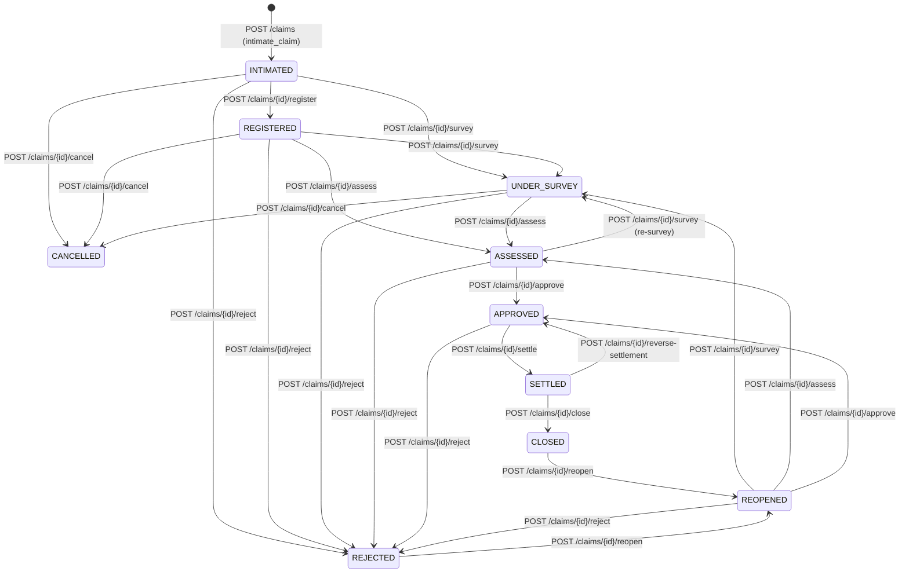

# Phase 10 — Claim State Machine (`phase_10_claim_state_machine.md`)

## 1. Overview
This document specifies the formal deterministic state machine for Motor Insurance Claims (`tbl_claims.ClaimStatus`), extracted from `Clerk/ClaimEntry.aspx.cs` and `Clerk/ClaimStatusUpdate.aspx.cs`.

---

## 2. Canonical Claim States

| State Code | Legacy Label | Meaning | Terminal? |
|---|---|---|---|
| `INTIMATED` | `Intimated` | Initial claim notice (FNOL) logged against an active policy. | No |
| `REGISTERED` | `Registered` | Claim verified by Claims Officer/Operations and insurer reference assigned. | No |
| `UNDER_SURVEY` | `Under Survey` | Licensed surveyor assigned to inspect vehicle/loss. | No |
| `ASSESSED` | `Assessed` | Survey report submitted and net payable loss assessed (`ApprovedAmount` computed). | No |
| `APPROVED` | `Approved` | Claim assessment approved by authorized management (`Admin`, `HO`, `Manager`, `Accounts`). | No |
| `SETTLED` | `Settled` | Claim settlement payment recorded and accounting entries (`AccTransId = 15`) posted to `tbl_account`. | No (can transition to `CLOSED` or be reversed on error) |
| `CLOSED` | `Closed` | Claim file completed and archived after settlement discharge. | Yes (unless explicitly `REOPENED` by authorized role) |
| `REJECTED` | `Rejected` | Claim repudiated/rejected with mandatory `RejectionReason`. | Yes (unless explicitly `REOPENED` by authorized role) |
| `CANCELLED` | `Cancelled` | Claim withdrawn/cancelled prior to settlement. | Yes |
| `REOPENED` | `Reopened` | Previously `REJECTED` or `CLOSED` claim reopened by management for re-assessment. | No |

---

## 3. State Transition Matrix

---

## 4. Transition Preconditions & Invariants

| Source State(s) | Target State | Action | Required Preconditions & Guards |
|---|---|---|---|
| `(New)` | `INTIMATED` | `intimate_claim` | Policy exists, `isdeleted == "0"`, `PolicycancelId == 0`, `PolicyStartDate <= LossDate <= PolicyEndDate`, `IntimationDate >= LossDate`, `ClaimType` matches policy coverage (`OD` vs `TP`), `EstimatedAmount > 0`. |
| `INTIMATED` | `REGISTERED` | `register_claim` | Valid `insurer_claim_ref` or registration remarks; caller has `CLAIM_UPDATE_ROLES`. |
| `INTIMATED`, `REGISTERED`, `ASSESSED`, `REOPENED` | `UNDER_SURVEY` | `update_survey` | `SurveyorName` non-empty, `SurveyDate >= IntimationDate`. |
| `REGISTERED`, `UNDER_SURVEY`, `REOPENED` | `ASSESSED` | `assess_claim` | `AssessedLossAmount > 0`; `DepreciationAmount`, `DeductibleAmount`, `ExcessAmount`, `SalvageAmount >= 0`; computed `ApprovedAmount > 0`; for `OD`/`THEFT`/`TOTAL_LOSS`, `ApprovedAmount <= SumInsured` (when `SumInsured > 0`). |
| `ASSESSED`, `REOPENED` | `APPROVED` | `approve_claim` | Claim must have a valid assessment (`AssessedLossAmount > 0`, `ApprovedAmount > 0`); caller must belong to `CLAIM_APPROVE_SETTLE_ROLES` (`Admin`, `Managing Director`, `Director`, `VP`, `General Manager`, `HO`, `Manager`, `Accounts`). |
| `APPROVED` | `SETTLED` | `settle_claim` | `0 < SettledAmount <= ApprovedAmount`; valid `PayeeType` (`CUSTOMER`, `GARAGE`, `INSURER`) and `PaymentMode`; posts balanced accounting entries (`AccTransId = 15`) to `tbl_account`. |
| `SETTLED` | `CLOSED` | `close_claim` | `SettledAmount > 0` already recorded; transitions claim to `CLOSED`. |
| `SETTLED` | `APPROVED` | `reverse_claim_settlement` | Reverses settlement accounting entries (`AccTransId = 16` contra entries in `tbl_account`), resets `SettledAmount = 0`, and returns claim to `APPROVED`. Cannot reverse a claim whose settlement has already been reversed. |
| `INTIMATED`, `REGISTERED`, `UNDER_SURVEY`, `ASSESSED`, `APPROVED`, `REOPENED` | `REJECTED` | `reject_claim` | Non-empty `RejectionReason` required. **Forbidden** if `ClaimStatus == "SETTLED"` or `"CLOSED"` (`409 Conflict`). |
| `INTIMATED`, `REGISTERED`, `UNDER_SURVEY` | `CANCELLED` | `cancel_claim` | Non-empty `Remarks` required. **Forbidden** once `APPROVED` or `SETTLED` (`409 Conflict`). |
| `REJECTED`, `CLOSED` | `REOPENED` | `reopen_claim` | Non-empty `Remarks` required; caller must belong to `CLAIM_APPROVE_SETTLE_ROLES`. If reopening from `CLOSED` where a settlement was paid, settlement remains intact unless explicitly reversed first (`reverse_claim_settlement` is required before re-settling). |

---

## 5. Invalid Transitions (`409 Conflict`)
- Settling an `INTIMATED`, `REGISTERED`, `UNDER_SURVEY`, `ASSESSED`, `REJECTED`, or `CANCELLED` claim without prior `APPROVED` status returns `409 Conflict`.
- Approving an `INTIMATED` or `REGISTERED` claim that has not been assessed (`AssessedLossAmount == 0`) returns `409 Conflict`.
- Settling an already `SETTLED` or `CLOSED` claim returns `409 Conflict` (unless idempotent replay with matching `IdempotencyKey`).
- Rejecting or cancelling an already `SETTLED` or `CLOSED` claim returns `409 Conflict`.
