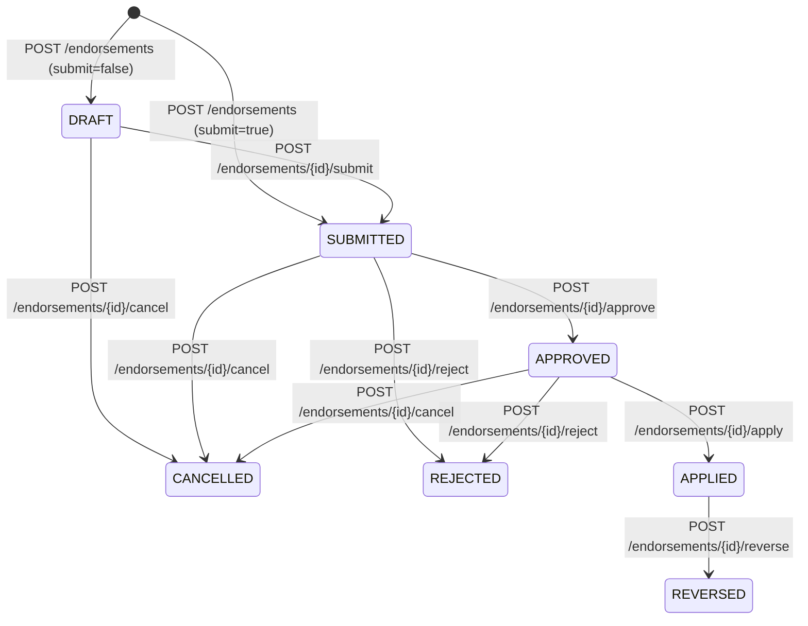
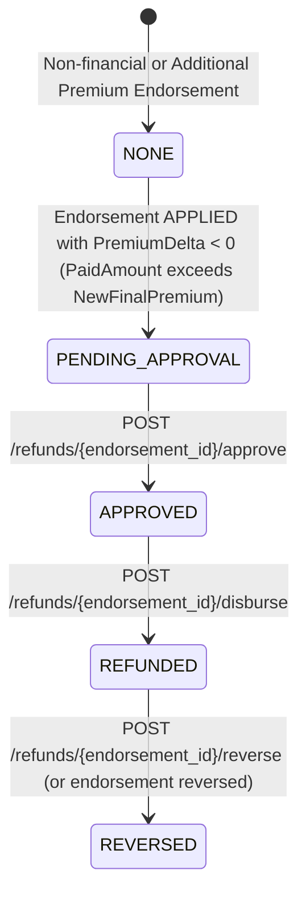

# Phase 10 — Endorsement State Machine (`phase_10_endorsement_state_machine.md`)

## 1. Overview
This document specifies the deterministic state machine for Policy Endorsements (`tbl_appendorsement.EndorsementStatus`) and the coupled Refund Sub-State Machine (`tbl_appendorsement.RefundStatus`), extracted from `Clerk/EndorsementEntry.aspx.cs` and `Clerk/AppEndorsementList.aspx.cs`.

---

## 2. Canonical Endorsement States

| State Code | Legacy Label | Meaning | Terminal? |
|---|---|---|---|
| `DRAFT` | `Draft` | Endorsement prepared but not yet submitted for approval. | No |
| `SUBMITTED` | `Pending` / `Submitted` | Endorsement request submitted with `before`/`after` field snapshot and calculated premium/commission deltas. | No |
| `APPROVED` | `Approved` | Endorsement verified and approved by an authorized underwriter/manager (`ENDORSEMENT_APPROVE_APPLY_ROLES`), ready for atomic application to the policy. | No |
| `APPLIED` | `Applied` / `Completed` | Endorsement changes, premium deltas, commission adjustments, and accounting entries atomically applied to `tbl_transaction`, `tbl_customer`, `tbl_vehicledetails`, `tbl_agentcommissionpayment`, `tbl_franchisecommission`, and `tbl_account`. | No (can be `REVERSED` by authorized role) |
| `REJECTED` | `Rejected` | Endorsement request rejected with mandatory `RejectionReason`. Policy remains unchanged. | Yes |
| `CANCELLED` | `Cancelled` | Endorsement request withdrawn before application. Policy remains unchanged. | Yes |
| `REVERSED` | `Reversed` | Previously `APPLIED` endorsement reversed; policy fields, premiums, commissions, and accounting entries restored to pre-endorsement state via contra entries. | Yes |

---

## 3. Endorsement State Transition Diagram

---

## 4. Coupled Refund Sub-State Machine (`RefundStatus`)

When an endorsement with a negative premium delta ($\Delta \text{Premium} < 0$) is applied (`EndorsementCategory == "REFUND_PREMIUM"`):

---

## 5. Transition Guards & Conflict Rules (`409 Conflict`)
1. **Cannot Apply Unapproved Endorsement**:
   - Calling `POST /api/v1/endorsements/{id}/apply` when `EndorsementStatus` is `DRAFT`, `SUBMITTED`, `REJECTED`, or `CANCELLED` returns `409 Conflict` (unless `auto_approve_and_apply=True` is explicitly invoked by an authorized `ENDORSEMENT_APPROVE_APPLY_ROLES` user).
2. **Idempotent Re-Apply Handling**:
   - Calling `apply` on an already `APPLIED` endorsement with the matching `IdempotencyKey` returns the existing applied endorsement without double-applying field changes, premium deltas, or accounting entries; calling `apply` without matching idempotency context returns `409 Conflict`.
3. **Cannot Reject or Cancel After Application**:
   - Once `EndorsementStatus == "APPLIED"`, `reject` and `cancel` are forbidden (`409 Conflict`); only `reverse` is permitted.
4. **Cannot Disburse Unapproved Refund**:
   - Calling `POST /api/v1/refunds/{endorsement_id}/disburse` when `RefundStatus != "APPROVED"` returns `409 Conflict`.
5. **Cannot Reverse Unapplied Endorsement**:
   - Calling `POST /api/v1/endorsements/{id}/reverse` when `EndorsementStatus != "APPLIED"` returns `409 Conflict`.
