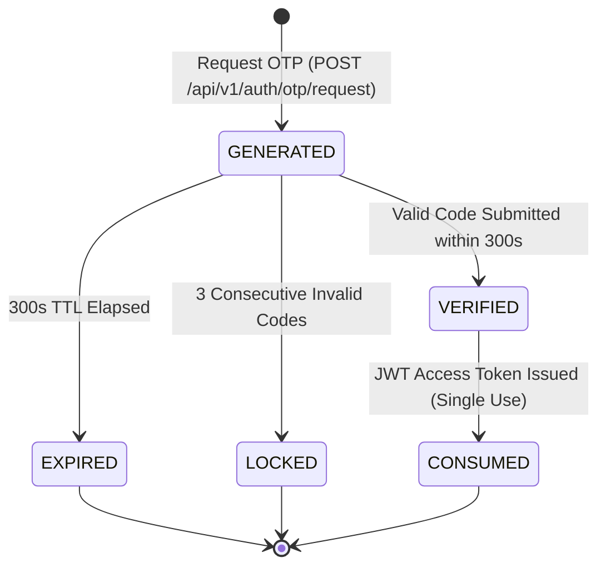

# Phase 13 — Atomicity, Idempotency & Concurrency Audit

> **Audit Status**: COMPLETE (CONCURRENCY & TRANSACTION BOUNDARIES ANALYZED)  
> **Phase**: Phase 13 (External Integrations, Notifications & Renewal) — Stage A  
> **Repository**: `Reliable-Insurance-Backend`  
> **Mode**: STRICTLY READ-ONLY (No transactions executed or locks acquired)

---

## 1. Overview

In distributed insurance systems handling third-party APIs, asynchronous messaging, and concurrent user updates, strict atomicity and idempotency guarantees are essential. This document audits legacy failure modes and establishes concurrency, caching, and idempotency safeguards for Phase 13.

---

## 2. Vehicle RC Caching & Concurrency Safeguards

### 2.1 Concurrency Race Condition in Legacy
In `RC_CheckVehicleDtl.aspx.cs` (L208–L318), the lookup checks `sp_Select_vehiclenorc_details`, calls the external API on cache miss, and executes `sp_InsertRCAPIDetails`.
- **Race Condition**: If two agents search for the same vehicle simultaneously, both experience a cache miss, both trigger billable third-party API calls, and the second insert either fails with duplicate key error or creates duplicate rows if unindexed.

### 2.2 FastAPI Idempotency & Concurrency Solution
1. **Database Constraint**:
   - `tbl_vehiclenorc_details` enforces a unique constraint on `license_plate_RegNo`.
2. **Distributed Cache / Double-Check Lock**:
   - When querying a vehicle:
     ```python
     async def get_or_fetch_vehicle_rc(
         session: AsyncSession, 
         reg_no: str, 
         provider: VehicleRCProvider
     ) -> VehicleRCDetails:
         # Step 1: Fast cache check
         cached = await repo.get_by_reg_no(session, reg_no)
         if cached:
             return cached
             
         # Step 2: Fetch from external provider
         external_data = await provider.lookup_rc(reg_no)
         if not external_data:
             raise ResourceNotFoundException("Vehicle RC not found")
             
         # Step 3: Atomic insert with upsert conflict handling
         try:
             async with session.begin_nested():
                 return await repo.create(session, external_data)
         except IntegrityError:
             # Concurrent insert won race; re-fetch cached row
             await session.rollback()
             return await repo.get_by_reg_no(session, reg_no)
     ```
3. **Idempotency**: Repeated requests for the same registration number return cached data in $O(1)$ without redundant external vendor charges.

---

## 3. Mobile OTP Lifecycle & Brute-Force Defense

### 3.1 Legacy Deficiencies (`USP_UpdateOTP`)
- In legacy, OTPs had undefined TTL expiration and no attempt counters, making them susceptible to replay or brute-force enumeration attacks.

### 3.2 FastAPI Hardened OTP State Machine


### 3.3 Idempotency & Rate Limiting Rules
1. **Request Rate Limit**: Maximum 1 OTP request per mobile number per 60 seconds (prevents SMS gateway exhaustion and SMS bombing).
2. **TTL Window**: OTP expires unconditionally after 300 seconds (5 minutes).
3. **Max Verification Attempts**: Maximum 3 failed verification attempts per OTP session. Upon 3rd failure, session transitions to `LOCKED` and the OTP code is deleted.
4. **Single-Use Consumption**: Once verified, the OTP is invalidated immediately (`CONSUMED`). It cannot be reused to mint subsequent tokens.
5. **Storage Security**: Plaintext OTP codes are never logged or stored. In Redis or database, OTP is stored as a salted SHA-256 hash.

---

## 4. Renewal Follow-Up Workflow Atomicity

### 4.1 Legacy Two-Stage Mutation Audit (`PreYearRenewalEntryFollowup.aspx.cs:L89-L97`)
Legacy executes:
```csharp
if (Bll_obj.BLL_SelectPreYearRenewalStatus(Status, "Update")) {
    if (Bll_obj.BLL_SelectPreYearRenewalStatus(Status, "insert")) {
        // Success
    }
}
```
If the server crashes or the network disconnects between the `"Update"` and `"insert"` calls, the follow-up record remains permanently closed with no successor record created.

### 4.2 FastAPI Atomic Unit of Work
In the FastAPI service layer, status updates and history creation are bound to a single atomic database transaction:
```python
async def update_renewal_followup(
    session: AsyncSession,
    status_id: int,
    request: CreateRenewalFollowupRequest,
    current_user: User
) -> PolicyRenewalStatus:
    async with session.begin():
        current_status = await repo.get_by_id_for_update(session, status_id)
        if not current_status:
            raise ResourceNotFoundException("Renewal status record not found")
            
        # Update current active record
        current_status.remark = request.remark
        current_status.followup_date = request.followup_date
        current_status.updated_by = current_user.username
        current_status.updated_at = datetime.utcnow()
        
        # Insert audit trail entry
        history_entry = RenewalFollowupHistory(
            renewal_status_id=current_status.id,
            remark=request.remark,
            followup_date=request.followup_date,
            recorded_by=current_user.username
        )
        session.add(history_entry)
        
        # Atomic commit happens when exiting the context block
        return current_status
```

---

## 5. Outbound Notification Deduplication & Idempotency

### 5.1 Push & SMS Notification Deduplication
When the Celery Beat scheduled task runs daily to alert agents of expiring policies:
1. **Deduplication Key Formulation**:
   ```
   idempotency_key = sha256(
       f"RENEWAL:{transaction_id}:{expiry_threshold_days}:{today_date}"
   )
   ```
2. **Delivery Guard**:
   - Check Redis or `tbl_pushnotification_log` for the existence of `idempotency_key`.
   - If present, skip dispatch.
   - If absent, record `idempotency_key` with a 24-hour TTL and proceed to dispatch.
   - Prevents duplicate alerts if the scheduled worker process restarts or re-executes.
3. **Transient Error Backoff**:
   - Outbound HTTP provider calls utilize exponential backoff (max 3 retries: 2s, 4s, 8s).
   - Permanent 4xx client errors (e.g., invalid phone number) fail fast without retries.
