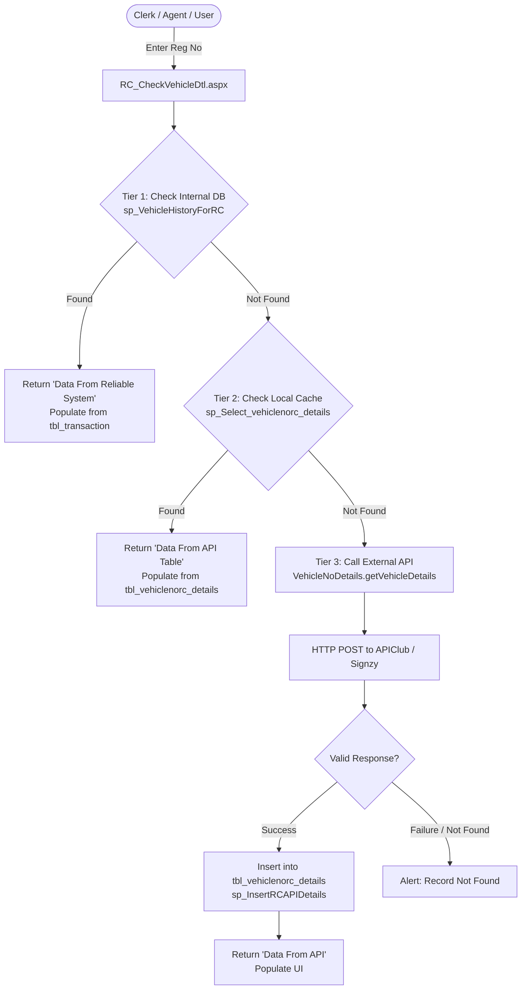

# Phase 13 — External Integrations & Vehicle RC Legacy Audit

> **Audit Status**: COMPLETE (CONFIRMED FROM LEGACY CODE & ADO.NET BINDINGS)  
> **Phase**: Phase 13 (External Integrations, Notifications & Renewal) — Stage A  
> **Repository**: `Reliable-Insurance-Backend`  
> **Legacy Source**: `InsurancefinalNew` (C#, ASP.NET WebForms, ADO.NET, MySQL)  
> **Mode**: STRICTLY READ-ONLY (No code modified, no migrations executed, no live network calls)

---

## 1. Executive Summary

Phase 13 Block A focuses on the **Vehicle Registration Certificate (RC) & KYC Verification Engine**.
In the legacy system, vehicle verification is an **advisory, caching pre-fill mechanism** rather than a blocking prerequisite for policy issuance. Agents and clerks query vehicle registration numbers to pre-populate customer, vehicle, and prior policy information, reducing manual typing errors and expediting policy quotation/booking.

Forensic audit of `InsurancefinalNew` reveals:
1. **Dual External Providers**:
   - **APIClub** (`https://prod.apiclub.in/api/v1/rc_info` / `https://uat.apiclub.in/api/v1/rc_info`): Currently active in `Insurance\VehicleNoDetails.cs` and `Insurance\Clerk\RC_CheckVehicleDtl.aspx.cs`.
   - **Signzy** (`https://api-preproduction.signzy.app/api/v3/vehicle/detailedsearches`): Historical / pre-production integration in `Insurance\VehicleService.asmx.cs`.
2. **Three-Tier Verification Cascade**:
   - **Tier 1 (Internal Broker System)**: Checks existing policy and transaction history in `tbl_transaction` / `tbl_custvehicle` via `BLL_vehiclenorc_details.BLL_VehicleHistoryForRC(reg_no, "REG")` (`sp_VehicleHistoryForRC`).
   - **Tier 2 (Local RC Cache Table)**: Checks previously fetched and cached RC records in `tbl_vehiclenorc_details` via `sp_Select_vehiclenorc_details`.
   - **Tier 3 (External API Provider)**: Calls the third-party HTTP provider (`VehicleNoDetails.getVehicleDetails`), parses 54 JSON fields, and persists the payload into `tbl_vehiclenorc_details` via `sp_InsertRCAPIDetails`.
3. **Security Vulnerability in Legacy**:
   - Raw production API keys (`x-api-key: [REDACTED_LEGACY_KEY]` and `Authorization: [REDACTED_LEGACY_TOKEN]`) were hardcoded directly in C# source files. In FastAPI, this must be isolated via pluggable provider interfaces and environment variables (`DEF-002`).

---

## 2. Legacy Source Code Evidence Inventory

| # | File Path | Component Type | Primary Methods / Responsibilities |
| :--- | :--- | :--- | :--- |
| 1 | `Insurance\Clerk\RC_CheckVehicleDtl.aspx.cs` | ASP.NET WebForm CodeBehind | User UI for vehicle lookup; coordinates 3-tier cascade (`btn_View_Click`, `LoadData`, `LoadDataFromRA`, `GetVehRC_Details`). |
| 2 | `Insurance\Clerk\RC_CheckVehicleDtl.aspx` | ASP.NET WebForm Markup | Display grid for 54 vehicle/owner fields; tabs for "Data From Reliable System", "Data From API Table", and "Data From API". |
| 3 | `Insurance\VehicleNoDetails.cs` | HTTP Client Helper | Calls APIClub REST API via `HttpWebRequest`, passes JSON body `{"vehicleId":"..."}`, deserializes response into `DataTable`. |
| 4 | `Insurance\VehicleService.asmx.cs` | ASMX Web Service | Implements `GetVehicleDetails(vehicleNumber, blacklistCheck, splitAddress)` calling Signzy pre-production endpoint. |
| 5 | `BLL\BLL_CustVehicle.cs` | Business Logic Layer | Wraps `BLL_insert_vehiclenorc_details`, `BLL_Select_vehiclenorc_details`, and `BLL_VehicleHistoryForRC`. |
| 6 | `DAL\DAL_Operations.cs` | Data Access Layer | Executes ADO.NET calls to `sp_InsertRCAPIDetails`, `sp_Select_vehiclenorc_details`, and `sp_VehicleHistoryForRC` (L43975–L44105). |
| 7 | `API\AllMaster.cs` | DTO / Model Class | Defines `API_vehiclenorc_details` containing all 54 vehicle attributes (L3146–L3208). |

---

## 3. Detailed Data Flow & Execution Cascade

### 3.1 Tier 1: Internal System Lookup (`sp_VehicleHistoryForRC`)
- **Method**: `BLL_vehiclenorc_details.BLL_VehicleHistoryForRC(txtregno.Value, "REG")`
- **Stored Procedure**: `sp_VehicleHistoryForRC`
- **Parameters**: `P_RegistrationNo` (VARCHAR), `P_opr` ("REG")
- **Behavior**: Searches previously booked policies in `tbl_transaction` joined with `tbl_custvehicle`. If the vehicle has an existing broker policy history, displays:
  - Owner Name, Insurance Company, Policy Number, Expiry Date, Vehicle Class, Category, Fuel Type, Make, Model, CC, Gross Weight, Mfg Date.
  - Banner: `Data From Reliable System`.

### 3.2 Tier 2: Cache Lookup (`sp_Select_vehiclenorc_details`)
- **Method**: `BLL_vehiclenorc_details.BLL_Select_vehiclenorc_details(txtregno.Value)`
- **Stored Procedure**: `sp_Select_vehiclenorc_details`
- **Parameters**: `P_rc_regn_no` (VARCHAR)
- **Behavior**: Queries `tbl_vehiclenorc_details` by registration number. If cached, renders all 54 cached attributes without incurring external vendor charges.
  - Banner: `Data From API Table`.

### 3.3 Tier 3: External API Provider Lookup (`VehicleNoDetails.cs`)
- **Method**: `VehicleNoDetails.getVehicleDetails(vehicleId)`
- **URL**: `https://prod.apiclub.in/api/v1/rc_info` (UAT: `https://uat.apiclub.in/api/v1/rc_info`)
- **Method**: `POST`
- **Headers**:
  - `Content-Type: application/json`
  - `Accept: application/json`
  - `Referer: docs.apiclub.in`
  - `x-api-key: [CREDENTIAL PRESENT — VALUE REDACTED]`
- **Request Body**: `{"vehicleId": "<registration_no>"}`
- **Security Protocol**: `ServicePointManager.SecurityProtocol = SecurityProtocolType.Tls12`
- **Response Parsing**:
  - Unpacks top-level response JSON into DataTable.
  - Extracts nested vehicle record from data payload (`dt.Rows[0][4]`).
  - Converts into `API_vehiclenorc_details` DTO.

### 3.4 Tier 3 Persistence: Cache Insert (`sp_InsertRCAPIDetails`)
- **Method**: `DAL_Operations.DAL_insert_vehiclenorc_details(rc)`
- **Stored Procedure**: `sp_InsertRCAPIDetails`
- **Parameters**: 51 parameters covering all vehicle specifications, registration details, insurance, PUCC, permits, and auditing.
- **Cache Persistence**: Records `CreatedDate = DateTime.Now` and `CreatedBy = Session["UserName"]`.
- **Banner**: `Data From API`.

---

## 4. Entity Schema & 54 Fields Catalog (`API_vehiclenorc_details`)

The legacy entity class `API_vehiclenorc_details` (`API\AllMaster.cs:L3146–L3208`) defines exactly 54 fields:

| # | Field Name | Data Type | Nullable | Description / Usage |
| :--- | :--- | :--- | :--- | :--- |
| 1 | `VehRcId` | INT | No | Primary Key (auto-increment / internal ID) |
| 2 | `request_id` | VARCHAR | Yes | External provider request UUID / correlation ID |
| 3 | `license_plate_RegNo` | VARCHAR | No | Vehicle Registration Number (e.g., `MH12AB1234`) |
| 4 | `owner_name` | VARCHAR | Yes | Registered Owner Full Name |
| 5 | `father_name` | VARCHAR | Yes | Owner's Father Name |
| 6 | `is_financed` | VARCHAR | Yes | Financing Flag (`true` / `false` / `YES` / `NO`) |
| 7 | `financer` | VARCHAR | Yes | Hypothecation Bank / Financier Name |
| 8 | `present_address` | VARCHAR | Yes | Present / Communication Address |
| 9 | `permanent_address` | VARCHAR | Yes | Permanent Registered Address |
| 10 | `insurance_company` | VARCHAR | Yes | Current / Prior Insurance Company Name |
| 11 | `insurance_policy` | VARCHAR | Yes | Existing Policy Number |
| 12 | `insurance_expiry` | DATETIME | Yes | Policy Expiry Date (`DateTime.MinValue` if empty) |
| 13 | `rc_class` | VARCHAR | Yes | Vehicle Class (e.g., `Motor Car`, `Goods Carrier`) |
| 14 | `category` | VARCHAR | Yes | Vehicle Category (e.g., `LMV`, `MCWG`, `HGV`) |
| 15 | `registration_date` | DATETIME | Yes | Vehicle Registration Date |
| 16 | `vehicle_age` | VARCHAR | Yes | Computed Vehicle Age String (e.g., `4 years 2 months`) |
| 17 | `pucc_upto` | DATETIME | Yes | PUC Certificate Expiry Date |
| 18 | `pucc_number` | VARCHAR | Yes | PUC Certificate Number |
| 19 | `chassis_number` | VARCHAR | Yes | Vehicle Chassis Number (VIN) |
| 20 | `engine_number` | VARCHAR | Yes | Engine Serial Number |
| 21 | `fuel_type` | VARCHAR | Yes | Fuel Type (`PETROL`, `DIESEL`, `CNG`, `ELECTRIC`) |
| 22 | `brand_name` | VARCHAR | Yes | Manufacturer / Make Name (e.g., `MARUTI SUZUKI`) |
| 23 | `brand_model` | VARCHAR | Yes | Model Name (e.g., `SWIFT DZIRE VXI`) |
| 24 | `body_type` | VARCHAR | Yes | Body Type (e.g., `SALOON`, `SEDAN`, `OPEN`) |
| 25 | `cubic_capacity` | VARCHAR | Yes | Engine Cubic Capacity (`CC`) |
| 26 | `gross_weight` | VARCHAR | Yes | Gross Vehicle Weight (`GVW` in kg) |
| 27 | `cylinders` | VARCHAR | Yes | Number of Cylinders |
| 28 | `color` | VARCHAR | Yes | Vehicle Color |
| 29 | `norms` | VARCHAR | Yes | Emission Norms (e.g., `BHARAT STAGE IV`, `BS VI`) |
| 30 | `fit_up_to` | VARCHAR | Yes | Fitness Certificate Validity Date |
| 31 | `manufacturing_date` | VARCHAR | Yes | Manufacturing Month / Year (e.g., `03/2019`) |
| 32 | `manufacturing_date_formatted` | VARCHAR | Yes | Standardized Manufacturing Date String |
| 33 | `rto_name` | VARCHAR | Yes | Registering Authority / RTO Office Name |
| 34 | `latest_by` | VARCHAR | Yes | Last RC Status Update Timestamp |
| 35 | `sleeper_capacity` | VARCHAR | Yes | Commercial Bus Sleeper Berths Count |
| 36 | `standing_capacity` | VARCHAR | Yes | Commercial Bus Standing Passengers Count |
| 37 | `wheelbase` | VARCHAR | Yes | Wheelbase Dimension (mm) |
| 38 | `unladen_weight` | VARCHAR | Yes | Unladen Weight (kg) |
| 39 | `noc_details` | VARCHAR | Yes | NOC Details (if transferred between states) |
| 40 | `seating_capacity` | VARCHAR | Yes | Seating Capacity (including driver) |
| 41 | `owner_count` | VARCHAR | Yes | Ownership Serial Number (e.g., `1`, `2`) |
| 42 | `tax_upto` | VARCHAR | Yes | Road Tax Paid Upto Date |
| 43 | `tax_paid_upto` | VARCHAR | Yes | Road Tax Payment Expiry / Lifetime Tax Status |
| 44 | `permit_number` | VARCHAR | Yes | Commercial Transport Permit Number |
| 45 | `permit_issue_date` | VARCHAR | Yes | Permit Issue Date |
| 46 | `permit_valid_from` | VARCHAR | Yes | Permit Validity Start Date |
| 47 | `permit_valid_upto` | VARCHAR | Yes | Permit Validity End Date |
| 48 | `permit_type` | VARCHAR | Yes | Permit Type (e.g., `GOODS PERMIT`, `CONTRACT CARRIAGE`) |
| 49 | `national_permit_number`| VARCHAR | Yes | National Permit (`NP`) Number |
| 50 | `national_permit_upto` | VARCHAR | Yes | National Permit Expiry Date |
| 51 | `national_permit_issued_by`| VARCHAR | Yes | Authority Issuing National Permit |
| 52 | `rc_status` | VARCHAR | Yes | RC Status (`ACTIVE`, `SUSPENDED`, `CANCELLED`) |
| 53 | `CreatedDate` | DATETIME | No | Audit Record Creation Timestamp |
| 54 | `CreatedBy` | VARCHAR | No | Username of Clerk / User performing lookup |

---

## 5. Architectural Modernization Strategy for FastAPI

To achieve 100% legacy parity without inheriting security or testability flaws:

1. **Pluggable Provider Architecture**:
   - Define abstract base class `VehicleRCProvider`.
   - Provide concrete implementations:
     - `MockVehicleRCProvider`: Deterministic responses based on registration number patterns for local dev and CI/CD testing.
     - `APIClubRCProvider`: Production/UAT integration for APIClub v1.
     - `SignzyRCProvider`: Production/UAT integration for Signzy v3.
   - Provider selection managed entirely by `RC_PROVIDER_TYPE` configuration (`"mock"`, `"apiclub"`, `"signzy"`).
2. **Environment Variable Configuration**:
   - Zero hardcoded API keys. All keys loaded via `pydantic_settings` from `.env` (`RC_API_KEY`, `RC_API_URL`, `RC_TIMEOUT_SECONDS`).
3. **Database Caching (`tbl_vehiclenorc_details`)**:
   - Model `VehicleRCDetails` mapped to `tbl_vehiclenorc_details` with unique/indexed `license_plate_RegNo`.
   - Before invoking external HTTP API, check `VehicleRCDetails`.
   - Cache TTL or force-refresh parameter (`force_refresh: bool = False`) supported for administrative lookups.
4. **FastAPI Endpoint**:
   - `POST /api/v1/integrations/vehicle-rc/lookup`
   - Request schema: `VehicleRCLookupRequest(registration_number: str, force_refresh: bool = False)`
   - Response schema: `VehicleRCLookupResponse(source: str, data: VehicleRCDetailsSchema)`
   - Sources: `"INTERNAL_SYSTEM"`, `"LOCAL_CACHE"`, `"EXTERNAL_API"`.
