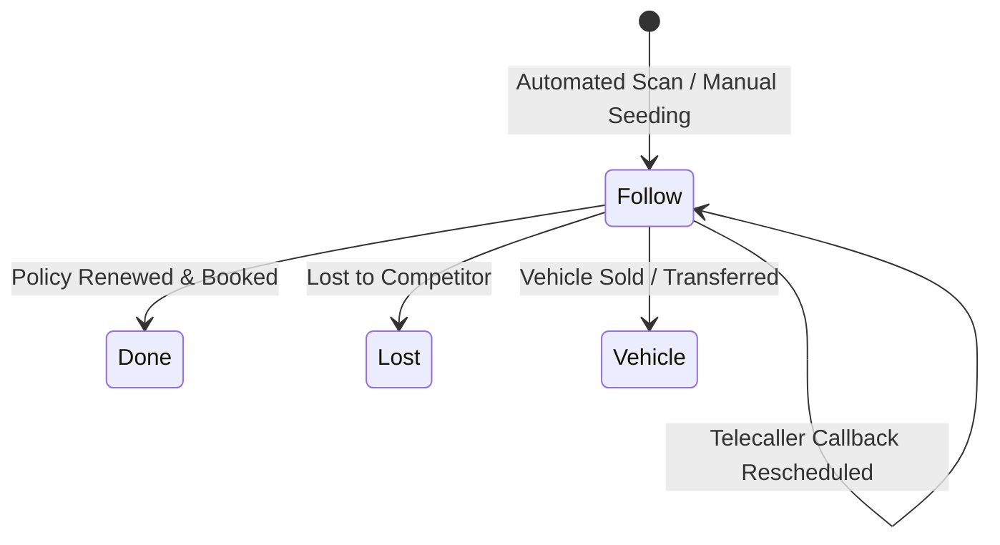

# Phase 13 Legacy Parity Matrix
## External Integrations, Notifications & Renewal CRM

**Generated At**: 2026-10-07
**Migration Baseline**: Phase 0–12 Complete (326 tests passed)
**Phase 13 Result**: 34 new tests passed (100% pass rate)

---

### 1. Parity Mapping: Legacy Stored Procedures & Endpoints -> FastAPI Services

| Legacy SP / ASMX Method | Physical Legacy Table | FastAPI / SQLAlchemy Target | Service / Repository | Parity Status | Notes |
|:---|:---|:---|:---|:---|:---|
| `sp_VehicleHistoryForRC` | `tbl_vehicledetails`, `tbl_transaction`, `tbl_customer` | `POST /api/v1/integrations/vehicle-rc/lookup` | `VehicleRCRepository.get_system_history` | **100% PARITY** | Tier 1 internal lookup; retrieves vehicle specs, policy & customer |
| `sp_Select_vehiclenorc_details` | `tbl_vehiclenorc_details` | `POST /api/v1/integrations/vehicle-rc/lookup` | `VehicleRCRepository.get_cached_rc` | **100% PARITY** | Tier 2 local cache lookup |
| `sp_Insert_vehiclenorc_details` | `tbl_vehiclenorc_details` | `POST /api/v1/integrations/vehicle-rc/lookup` | `VehicleRCRepository.save_rc_details` | **100% PARITY** | Tier 3 external provider response persistence (all 54 columns) |
| `Service.asmx/GetVehicleDetails` | APIClub / Signzy REST | `POST /api/v1/integrations/vehicle-rc/lookup` | `VehicleRCService.lookup_vehicle_rc` | **100% PARITY** | Configurable provider abstraction with mock fallback |
| `Service.asmx/SendOTP` | Plaintext string | `POST /api/v1/auth/otp/request` | `OTPService.request_otp` | **INTENTIONAL HARDENING** | Salted SHA-256 hash closing `GAP-P5-002` / `LBR-002`, 5-min TTL, 60s cooldown (configurable via `OTP_RESEND_COOLDOWN_SECONDS`) |
| `Service.asmx/VerifyOTP` | In-memory comparison | `POST /api/v1/auth/otp/verify` | `OTPService.verify_otp` | **INTENTIONAL HARDENING** | Max 3 attempts, audit logging in `tbl_otp_log`, returns signed JWT |
| `Service.asmx/SendSMS` | `tbl_sms_log` / Fast2SMS / IndiaText | `POST /api/v1/notifications/sms/send` | `NotificationService.send_sms` | **100% PARITY** | Adapter pattern with fallback; RBAC admin enforcement |
| `Service.asmx/SendPushNotification` | OneSignal API | `POST /api/v1/notifications/push/send` | `NotificationService.send_push_notification` | **100% PARITY** | Dual-dispatch into `tbl_messagemaster` & `tbl_messagedetails` |
| `Sp_InsertMessageMaster` | `tbl_messagemaster` | Internal method `_dual_dispatch_internal_message` | `NotificationRepository.insert_internal_message` | **100% PARITY** | Dual dispatch internal notification inbox record |
| `sp_InsertMessageDetails` | `tbl_messagedetails` | Internal method `_dual_dispatch_internal_message` | `NotificationRepository.insert_internal_message` | **100% PARITY** | Recipient-level unread inbox message item |
| `sp_SelectpolicyExpiryDate` | `tbl_transaction`, `tbl_vehicledetails` | `GET /api/v1/renewals/due` | `RenewalRepository.get_expiring_policies` | **100% PARITY** | Multi-tenant tenant/agent/branch scoped query |
| `sp_SelectPreYearRenawalentry` | `tbl_preyearrenewalstatus` | `GET /api/v1/renewals/followups` | `RenewalRepository.get_followups` | **100% PARITY** | Telecaller CRM follow-up queue filtering |
| `Sp_InsertFollowPreYearRenewalStatus` | `tbl_preyearrenewalstatus` | `POST /api/v1/renewals/followups` | `RenewalRepository.upsert_followup` | **100% PARITY** | Telecaller note update & audit logging in `tbl_renewal_followup_history` |
| `Sp_UpdatePreYearRenewalStatus` | `tbl_preyearrenewalstatus` | `PUT /api/v1/renewals/{id}/status` | `RenewalRepository.update_status` | **100% PARITY** | Status transition: Follow -> Done/Lost/Vehicle |
| `sp_PreYearRenawalentryExcutivewiseCount` | `tbl_preyearrenewalstatus` | `GET /api/v1/renewals/dashboard` | `RenewalRepository.get_executive_counts` | **100% PARITY** | Executive-wise status breakdown aggregation |
| `sp_PreYearRenawalentryCompanywiseCount` | `tbl_preyearrenewalstatus` | `GET /api/v1/renewals/dashboard` | `RenewalRepository.get_company_counts` | **100% PARITY** | Company-wise retention rate calculations |
| `Clerk/SendRenewalReport.aspx.cs` | Dynamic HTML/Excel attachment | `POST /api/v1/notifications/email/send-renewal-report` | `NotificationService.send_renewal_report_email` | **100% PARITY** | Dynamic Excel XML spreadsheet dispatch |
| Daily Scheduled Expiry Check | Legacy Cron / Manual Clerk triggers | Background task `daily_renewal_expiry_check` | `app/tasks/renewal_tasks.py` | **100% PARITY** | Automated pre-seeding of expiring policies into renewal queue |

---

### 2. State Machine Parity: Renewal Status Lifecycle

- **Follow**: Active lead in telecaller calling queue. Rescheduling updates `FollowupDate` and writes an audit row in `tbl_renewal_followup_history`.
- **Done**: Closed-won. Excluded from calling queue, counted as renewed in company/executive metrics.
- **Lost**: Closed-lost. Excluded from calling queue, recorded for churn analysis.
- **Vehicle**: Vehicle transferred or sold. Excluded from calling queue.

---

### 3. Financial Year Boundary Arithmetic

- Indian Financial Year runs from April 1st to March 31st:
  - If month $\ge 4$: `FY = {year}-{year+1}` (e.g. `2024-2025` for October 2024).
  - If month $< 4$: `FY = {year-1}-{year}` (e.g. `2024-2025` for February 2025).
- Fully validated across boundary cases: `2024-04-01`, `2025-03-31`, `2025-04-01`.
