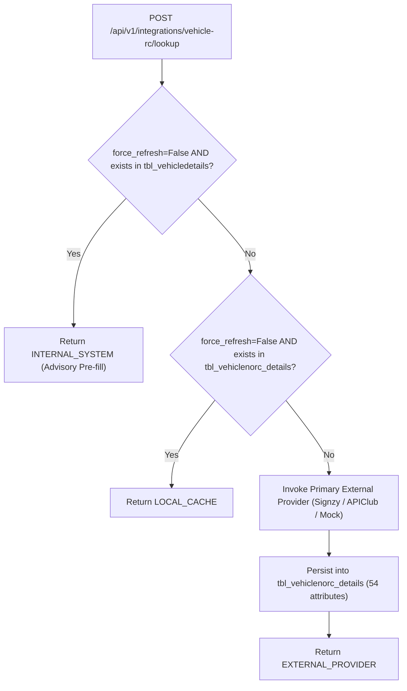

# Phase 13 External Provider Parity Specification

**Generated At**: 2026-10-07
**Components**: Vehicle RC Adapters, SMS Gateways, Push Notification, SMTP Email

---

### 1. Vehicle Registration Certificate (RC) Adapters

Legacy system directly contacted external vendor endpoints from C# without a standardized interface or multi-tier cascade. Phase 13 introduces an abstract base interface `VehicleRCProvider` with pluggable implementations:

1. **`MockVehicleRCProvider`**:
   - Deterministic test harness providing realistic 54-attribute vehicle specifications.
   - Configurable behavior (`simulate_not_found`, `simulate_error`).
   - Default for local development and CI testing (`ENV != production`).

2. **`APIClubVehicleRCProvider`**:
   - Endpoint: configured via `config.APICLUB_RC_URL`.
   - Headers: Bearer token authorization via `config.APICLUB_API_KEY`.
   - Response Normalization: Maps vendor payload to canonical 54-attribute `VehicleRCData` model.

3. **`SignzyVehicleRCProvider`**:
   - Endpoint: configured via `config.SIGNZY_RC_URL`.
   - Headers: `Authorization` with Signzy access token.
   - Fallback cascading if primary provider fails.

#### 3-Tier Lookup Cascade Architecture:

---

### 2. SMS Gateway Adapters

Phase 13 establishes the `SMSProvider` abstraction:
1. **`MockSMSProvider`**: In-memory message store `sent_messages` enabling deterministic assertions in automated tests.
2. **`Fast2SMSProvider`**:
   - Gateway URL: `https://www.fast2sms.com/dev/bulkV2`
   - Authorization: API Key in headers
   - Format: Standard URL-encoded / JSON quick SMS format.
3. **`IndiaTextSMSProvider`**:
   - Legacy provider URL: configured via `config.INDIATEXT_SMS_URL`.
   - Parameters: `username`, `password`, `sender`, `to`, `message`.

Audit trail: Every outbound SMS attempt is asynchronously persisted into `tbl_sms_log` with status (`SENT` / `FAILED`), provider name, and error message if applicable.

---

### 3. Push Notification Adapter (OneSignal)

1. **`MockPushNotificationProvider`**: Records dispatches in `dispatched_notifications`.
2. **`OneSignalPushProvider`**:
   - API Endpoint: `https://onesignal.com/api/v1/notifications`
   - App ID: `config.ONESIGNAL_APP_ID`
   - REST API Key: `config.ONESIGNAL_API_KEY`
   - Target: `include_external_user_ids` matching Reliable user IDs.

Dual Dispatch: In addition to external push notification dispatch, Phase 13 duplicates every notification into internal database inboxes (`tbl_messagemaster` and `tbl_messagedetails`), ensuring users without active mobile push subscriptions can read notifications from their dashboard web inbox.

---

### 4. SMTP Email Adapter

1. **`MockEmailProvider`**: In-memory sent email registry `sent_emails`.
2. **`SMTPEmailProvider`**:
   - Connects using standard asynchronous `aiosmtplib` with STARTTLS / SSL support.
   - Renders Excel XML spreadsheets on the fly with headers and tabular renewal rows.
