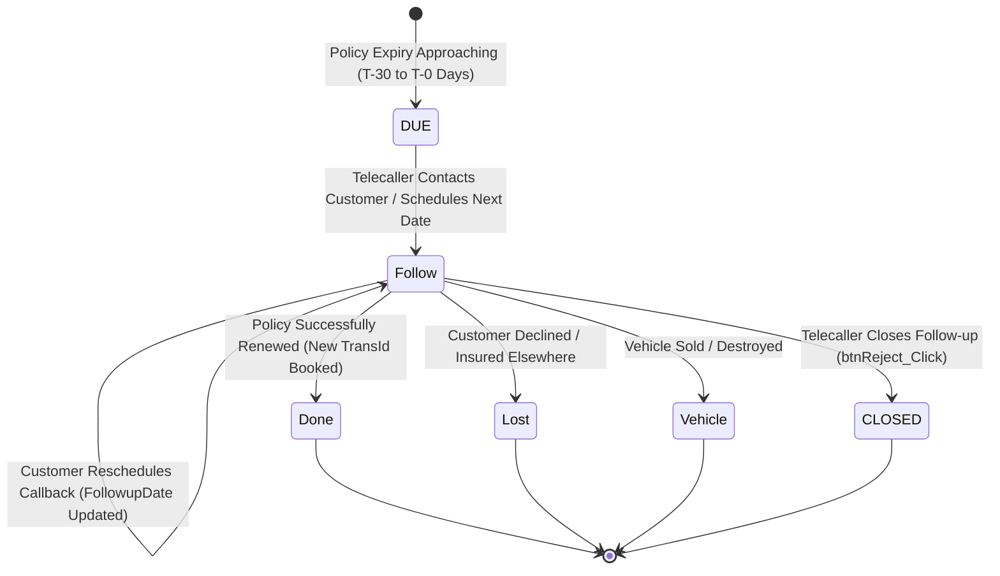

# Phase 13 — Policy Renewal Engine Legacy Audit

> **Audit Status**: COMPLETE (CONFIRMED FROM C# CODE, STORED PROCEDURES & DTO DEFINITIONS)  
> **Phase**: Phase 13 (External Integrations, Notifications & Renewal) — Stage A  
> **Repository**: `Reliable-Insurance-Backend`  
> **Legacy Source**: `InsurancefinalNew` (`PreYearRenewalEntryFollowup.aspx.cs`, `Dashboard_PrevYearRenewalStatus.aspx.cs`, `adm_renewalnotistatus.aspx.cs`)  
> **Mode**: STRICTLY READ-ONLY (No schema alterations or record insertions executed)

---

## 1. Executive Summary

The Policy Renewal Engine is a core revenue-protection operational workflow for the insurance broker. It identifies expiring vehicle policies, orchestrates multi-touch reminder notifications, supports a dedicated telecaller follow-up CRM, and tracks renewal retention through an executive-level performance dashboard.

Forensic audit of `InsurancefinalNew` confirms:
1. **Dedicated Tracking Table (`tbl_preyearrenewalstatus`)**:
   - Stores operational renewal status per vehicle registration number and financial year `(RegistrationNo, FinancialYear)`.
   - Maps 14 explicit columns modeled in `API_PreYearRenewalStatus`.
2. **Four-State Renewal Lifecycle**:
   - `Follow`: Active telecaller pursuit with a scheduled callback date (`FollowupDate`).
   - `Done`: Successfully renewed into a new booked policy.
   - `Lost`: Lost to competitor or client declined renewal.
   - `Vehicle`: Vehicle sold, transferred, or scrapped.
3. **Role-Based Telecaller & Conversion Attribution**:
   - Segmented into 4 hierarchy tiers: Executive (`EX`), Agent (`AG`), Franchisee (`FR`), and Associate Franchisee (`AFR`).
4. **Indian Financial Year Arithmetic**:
   - Hardcoded April 1 to March 31 boundary logic (`Month <= 3` falls into previous calendar year) generating standard fiscal labels (e.g., `2024-2025`).

---

## 2. Legacy Source Code & Flow Inventory

| # | File Path | Component Type | Primary Responsibilities |
| :--- | :--- | :--- | :--- |
| 1 | `Insurance\Clerk\PreYearRenewalEntryFollowup.aspx.cs` | WebForm CodeBehind | Telecaller CRM screen; lists expiring policies, records client contact remarks, updates follow-up dates (`btnDate_Click`, `btnReject_Click`). |
| 2 | `Insurance\Clerk\Dashboard_PrevYearRenewalStatus.aspx.cs` | WebForm CodeBehind | Management dashboard; aggregates renewal conversion counts, executive breakdown, and company distribution (`fillData`, `FillExcutive`, `FillCompany`). |
| 3 | `Insurance\Clerk\adm_renewalnotistatus.aspx.cs` | WebForm CodeBehind | Operational audit report displaying push notification delivery logs for renewal reminders (`sp_renewalnotistatus`). |
| 4 | `Insurance\Clerk\adm_sendExcelTomailRenewal.aspx.cs` | WebForm CodeBehind | Bulk export and email dispatch of expiring policy spreadsheets to assigned agents. |
| 5 | `DAL\DAL_Operations.cs` (L39660–L39920) | Data Access Layer | Executes 11 specialized renewal stored procedures (`sp_SelectPrevYearRenewalPolicySatusDashboard`, `Sp_InsertFollowPreYearRenewalStatus`, etc.). |
| 6 | `API\AllMaster.cs` (L2704–L2722) | Entity Class | Defines `API_PreYearRenewalStatus` with all 14 database fields. |

---

## 3. Data Model & Field Mapping (`API_PreYearRenewalStatus`)

The entity class `API_PreYearRenewalStatus` maps directly to the underlying physical table `tbl_preyearrenewalstatus`:

| # | Property Name | Type | Nullable | Description / Business Meaning |
| :--- | :--- | :--- | :--- | :--- |
| 1 | `TransanctionId` | INT | No | Reference to originating policy in `tbl_transaction` |
| 2 | `Remark` | VARCHAR | Yes | Telecaller interaction note / client response text |
| 3 | `FinancialYear` | VARCHAR | No | Fiscal year identifier (e.g., `"2024-2025"`) |
| 4 | `isdeleted` | INT | No | Soft-delete sentinel flag (`0` = active, `1` = deleted) |
| 5 | `CreatedDate` | DATETIME | No | Timestamp of initial record creation |
| 6 | `RegistrationNo` | VARCHAR | No | Vehicle registration number |
| 7 | `InsuranceCompany` | VARCHAR | Yes | Current insuring company name |
| 8 | `TotalPremium` | DOUBLE | No | Prior year policy gross premium amount |
| 9 | `MobileNo` | VARCHAR | Yes | Insured / vehicle owner contact mobile number |
| 10 | `ExpiryDate` | DATETIME | No | Prior policy expiration date |
| 11 | `FollowupDate` | DATETIME | Yes | Next scheduled telecaller callback date/time |
| 12 | `UserRoleId` | INT | No | Assigned telecaller / user role ID |
| 13 | `AgentId` | INT | No | Originating booking Agent / POSP ID |
| 14 | `ExecutiveId` | INT | No | Assigned Sales Executive ID |

---

## 4. Renewal State Machine & Lifecycle Transitions



### 4.1 State Descriptions
1. **`DUE`**: Derived status for any policy whose `ExpiryDate` falls within the reminder window ($T-30, T-15, T-7, T-5, T-1$ days) and has no existing `Done` record in `tbl_preyearrenewalstatus` for the current financial year.
2. **`Follow`**: Telecaller has initiated contact; customer has requested a callback or quotes are being compared. Stored procedure parameter: `"Follow"`.
3. **`Done`**: Customer renewed policy with Reliable Assurance. Stored procedure parameter: `"Done"`.
4. **`Lost`**: Customer bought policy from a direct competitor or declined renewal. Stored procedure parameter: `"Lost"`.
5. **`Vehicle`**: Vehicle was sold, transferred to a new owner, or scrapped. Stored procedure parameter: `"Vehicle"`.

### 4.2 Hierarchy Segmentation Codes
In `sp_SelectPrevYearRenewalPolicySatusDashboard`, the stored procedure accepts role-prefixed operation codes:
- **Executive**: `EXFollow`, `EXDone`, `EXLost`, `EXVehicle`
- **Agent**: `AGFollow`, `AGDone`, `AGLost`, `AGVehicle`
- **Franchisee**: `FRFollow`, `FRDone`, `FRLost`, `FRVehicle`
- **Associate Franchisee**: `AFRFollow`, `AFRDone`, `AFRLost`, `AFRVehicle`

---

## 5. Telecaller Follow-Up Workflow (`PreYearRenewalEntryFollowup.aspx.cs`)

### 5.1 Step-by-Step CRM Flow
1. **Grid Population**:
   - `fillGrid()` invokes `BLL_Transaction.BLL_SelectFollowupEntry()` (`sp_SelectFollowupEntry`).
   - Retrieves all active follow-up entries assigned to the telecaller's branch/role.
2. **Scheduling a Follow-up (`btnDate_Click`)**:
   - User inputs next callback date in `txtfromdate.Value` and clicks Save.
   - Legacy executes a two-stage transaction:
     ```csharp
     // Stage 1: Close prior followup status
     if (Bll_obj.BLL_SelectPreYearRenewalStatus(Status, "Update")) {
         // Stage 2: Insert new followup row with updated FollowupDate
         if (Bll_obj.BLL_SelectPreYearRenewalStatus(Status, "insert")) {
             // Success popup
         }
     }
     ```
   - Target Stored Procedure: `Sp_InsertFollowPreYearRenewalStatus` (DAL L11507).
3. **Closing a Follow-up (`btnReject_Click`)**:
   - Telecaller closes follow-up without rescheduling.
   - Invokes `Bll_obj.BLL_SelectPreYearRenewalStatus(Status, "Update")`.
   - Grid is refreshed immediately.

---

## 6. Financial Year Calculation Formula

In `Dashboard_PrevYearRenewalStatus.aspx.cs` (L26–L32), Indian fiscal year boundaries are computed:

```csharp
int year;
if (DateTime.Now.Month <= 3) // January, February, March
    year = DateTime.Now.Year - 1;
else                        // April through December
    year = DateTime.Now.Year;

// Generates: "{year - 1}-{year}" (e.g., "2023-2024")
assigncurrentyear((year - 1).ToString() + "-" + year.ToString());
```

In FastAPI, this is encapsulated into a reusable utility `get_indian_financial_year(dt: Optional[datetime] = None) -> str` to ensure 100% calculation parity across all reporting and renewal modules.

---

## 7. Management Dashboard & Metrics Extraction

The renewal dashboard provides three analytical lenses:
1. **Summary Status Cards**: Total counts for `Follow`, `Done`, `Lost`, and `Vehicle`.
2. **Sales Executive Breakdown (`FillExcutive`)**:
   - Queries `sp_PreYearRenawalentryExcutivewiseCount(Month, FinancialYear)`.
   - Generates tabular breakdown of follow-up counts per Sales Executive with a bold grand-total summary row.
3. **Insurance Company Breakdown (`FillCompany`)**:
   - Queries `sp_PreYearRenawalentryCompanywiseCount(Month, FinancialYear)`.
   - Measures renewal retention rate per underwriting insurer.
4. **Visual Chart WebMethod (`GetChartData`)**:
   - JSON endpoint returning `List<RenewalSatusDetails>` (`RenewalStatus`, `Total`).

---

## 8. Modernized FastAPI Renewal Architecture

1. **Database Model**:
   - `PolicyRenewalStatus` mapped to `tbl_preyearrenewalstatus`.
   - Composite unique index on `(registration_no, financial_year)`.
2. **Endpoints (`/api/v1/renewals/`)**:
   - `GET /api/v1/renewals/due`: Lists policies expiring within the next $N$ days (configurable, default 30).
   - `GET /api/v1/renewals/followups`: Paginated list of active follow-up items with telecaller scoping.
   - `POST /api/v1/renewals/followups`: Records a customer interaction, updates remarks, and reschedules `followup_date`.
   - `PUT /api/v1/renewals/{id}/status`: Transitions status between `FOLLOW_UP`, `RENEWED`, `LOST`, and `VEHICLE_SOLD`.
   - `GET /api/v1/renewals/dashboard`: Aggregated metrics (total counts, executive breakdown, insurer breakdown).
3. **Automated Reminder Job (`Celery Beat`)**:
   - Scheduled daily job (`daily_renewal_expiry_check`) scanning for policies expiring in $30, 15, 7, 1$ days.
   - Triggers automated OneSignal push notifications and SMS reminders to assigned agents.
