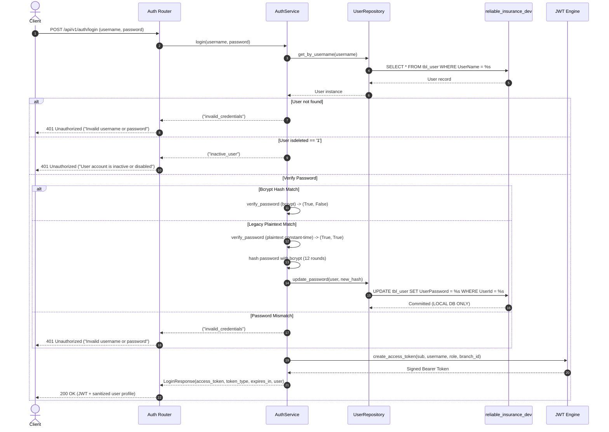

# Phase 3 Completion Report — Authentication & RBAC

## 1. Executive Summary
Phase 3 of the Reliable Assurance backend migration (C#/.NET 4.0 to FastAPI) has been completed successfully. This phase delivers an independent, production-grade asynchronous Authentication and Role-Based Access Control (RBAC) foundation built on the verified physical schemas of `tbl_user` and `tbl_userrole`.

The implementation includes:
- SQLAlchemy 2.0 async models for `tbl_user` (13 columns) and `tbl_userrole` (4 columns).
- Alembic migration `56635abf39f0` applied to local development database `reliable_insurance_dev`.
- Clean asynchronous repositories: `UserRepository` and `RoleRepository`.
- Domain service `AuthService` with dual-mode password verification (bcrypt + legacy plaintext compatibility) and automatic local bcrypt upgrade.
- RESTful authentication endpoints: `POST /api/v1/auth/login`, `GET /api/v1/auth/me`, and RBAC test probe `GET /api/v1/auth/admin-check`.
- Robust dependency injection: `get_current_user`, `require_roles(...)`, and `get_current_branch_id`.
- 16 new automated unit and integration tests, bringing the total suite to **52 tests passing (100%)**.

---

## 2. Authentication Architecture

### 2.1 Login Flow (`POST /api/v1/auth/login`)


### 2.2 Password Verification & Controlled Local Upgrade
- **Bcrypt Hashing**: Passwords stored with modern standard bcrypt (`$2b$` prefix, 12 work factor rounds).
- **Legacy Plaintext Compatibility**: In accordance with Phase 0 findings (~3,842 legacy users with plaintext passwords in `tbl_user.UserPassword`), plaintext comparison uses `hmac.compare_digest` to prevent timing attacks.
- **Local-Only Upgrade**: When a valid plaintext password is authenticated against the local development database, the user record is immediately upgraded to a bcrypt hash.
- **Production Safety Guarantee**: Zero writes, updates, or password migrations touch the legacy production database (`brahmainsurance`). Production migration remains a deferred, controlled batch operation.

### 2.3 JWT Design & Claims
- Algorithms: HMAC-SHA256 (`HS256`).
- Expiration: Configurable via `ACCESS_TOKEN_EXPIRE_MINUTES` (default 60 mins).
- Non-sensitive Payload Claims:
  - `sub`: User identifier string (`str(UserId)`)
  - `username`: Account username (`UserName`)
  - `role`: Role name string (e.g. `ADMIN`, `AGENT`, `OWNER`)
  - `role_id`: Role primary key (`UserRoleId`)
  - `branch_id`: Operational office branch identifier (`BranchId`)
  - `iat`, `exp`, `nbf`: Standard cryptographic timestamp claims
- Sensitive Data Exclusion: Passwords, password hashes, and secrets are stripped prior to signing.

---

## 3. Role-Based Access Control (RBAC)

### 3.1 Verified Legacy Roles Catalog
Introspected live from reference table `tbl_userrole`:

| UserRoleId | Role Name (`UserRole`) | Role Code (`code`) | Legacy Description / Scope |
|---|---|---|---|
| 1 | `OWNER` | `OWN` | Highest business owner executive privilege |
| 2 | `ADMIN` | `ADM` | System administrator with full operational access |
| 3 | `SUPERVISOR` | `SUP` | Branch supervisor / quotation approval authority |
| 4 | `AGENT` | `AGT` | Independent insurance agent / retail broker |
| 5 | `RELATIONSHIP MANAGER` | `RSM` | Partner relationship manager |
| 6 | `OPERATOR` | `OPT` | Data entry clerk for policy conversion |
| 7 | `CASHIER` | `CASH` | Cashier for cheque/cash instrument entry |
| 8 | `MANAGER` | `MGR` | Branch / operations manager |
| 9 | `FRANCHISE` | `FRN` | Franchise partner portal access |
| 10 | `SALES` | `SALES` | Sales representative |
| 11 | `ACCOUNT` | `ACC` | Financial accounting / accounts approval clerk |
| 12 | `ENDORSEMENT` | `END` | Policy alteration / endorsement processor |
| 13 | `CLAIM` | `CLM` | Claims processing officer |

### 3.2 Authorization Dependency (`require_roles`)
- Usage: `Depends(require_roles("ADMIN", "OWNER"))`.
- Case-Insensitive Matching: Compares normalized user role against permitted roles.
- Status Code Disambiguation:
  - **HTTP 401 Unauthorized**: Unauthenticated request, missing token, expired token, malformed signature, or inactive user.
  - **HTTP 403 Forbidden**: Authenticated caller whose role is not authorized for the requested endpoint (`{"error": {"code": "FORBIDDEN", "message": "Insufficient permissions for this operation"}}`).

---

## 4. Branch & Jurisdiction Scoping Foundation
- Verified Physical Column: `tbl_user.BranchId` (int, nullable).
- Dependency: `get_current_branch_id(current_user: User = Depends(get_current_user))`.
- Security Invariant: Branch ID is established strictly from the authenticated identity in the token/database. Client-supplied query parameters (`?BranchId=99`) or headers (`X-Branch-ID: 99`) are ignored for authorization.
- Future Scope: In later phases (Customers, Transactions, Accounting), service queries will apply server-side `where(Transaction.BranchId == authenticated_branch_id)` scoping.

---

## 5. Database Schema & Alembic Migration

### 5.1 Tables Created in `reliable_insurance_dev`
1. **`tbl_user`** (13 physical columns, PK `UserId`, unique index on `UserName`, indexes on `UserRoleId` and `BranchId`):
   - `UserId`, `UserName`, `UserPassword`, `UserRoleId`, `BranchId`, `isappuser`, `isdeleted`, `CreateDate`, `CreateUser`, `UpdateDate`, `UpdateUser`, `partner_user_id`, `mobile_no`
2. **`tbl_userrole`** (4 physical columns, PK `UserRoleId`):
   - `UserRoleId`, `UserRole`, `code`, `isdeleted`

### 5.2 Alembic Migration Status
- Migration Revision: [`56635abf39f0_create_phase3_user_and_role_tables.py`](file:///c:/Users/Admin/Desktop/Reliable-Insurance-Backend/alembic/versions/56635abf39f0_create_phase3_user_and_role_tables.py)
- Down Revision: `b84657b131fa`
- Table Options: `mysql_charset="utf8"`, `mysql_collate="utf8_general_ci"`, `mysql_row_format="DYNAMIC"`
- Foreign Key Constraints: **0** (strictly application-level referential integrity)

---

## 6. Test Suite Execution & Verification

### Test Suite Summary
```text
52 tests collected
52 passed
0 failed
0 skipped
100% pass rate in ~10.7s
```

### Breakdown by Test Category
- **Phase 1 Foundation Tests** (20 tests): Config, security, request ID middleware, structured logging, health/readiness, session lifecycle.
- **Phase 2 Models & Repositories Tests** (16 tests): Model column counts, PK verification, physical naming quirks, repository CRUD, rollback behavior.
- **Phase 3 Unit Tests** (`tests/unit/test_auth.py`, 6 tests):
  - `test_user_and_role_models`: Verified 13 columns in `tbl_user`, 4 in `tbl_userrole`.
  - `test_user_and_role_active_property`: `isdeleted == '0'` vs `'1'`.
  - `test_jwt_invalid_signature`: 401 on tampered signature.
  - `test_jwt_malformed_token`: 401 on malformed string.
  - `test_require_roles_checker_logic`: Role authorization vs 403 Forbidden.
  - `test_safe_user_schema_never_contains_password`: Asserted schema excludes passwords.
- **Phase 3 Integration Tests** (`tests/integration/test_auth_api.py`, 10 tests):
  - `test_login_success_bcrypt`: Valid login with bcrypt password, safe user context.
  - `test_login_legacy_plaintext_and_auto_upgrade`: Plaintext login + transparent upgrade in local DB.
  - `test_login_invalid_password`: 401 on bad password.
  - `test_login_nonexistent_user`: 401 on missing user.
  - `test_login_inactive_user_rejected`: 401 on `isdeleted='1'`.
  - `test_login_missing_or_invalid_payload`: 422 on empty/invalid payload.
  - `test_get_me_endpoint_success_and_safety`: Authenticated profile retrieval without passwords.
  - `test_get_me_unauthorized_variations`: Missing, invalid, or expired tokens return 401.
  - `test_rbac_authorization_admin_check`: 200 for ADMIN, 403 for AGENT, 401 for anonymous.
  - `test_branch_isolation_context_cannot_be_spoofed`: Client cannot spoof `BranchId`.

---

## 7. Known Gaps & Production Verification Items
1. **Multi-Role Assignment**: Production schema links one role per user via `tbl_user.UserRoleId`. The table `tbl_userrolereferencetype` exists in production but appears to configure reference types rather than multiple roles. Multi-role assignment capability requires customer verification if needed.
2. **Branch Jurisdiction Scope**: Whether `BranchId = NULL` or `BranchId = 0` denotes a head-office global scope requires business confirmation.
3. **Password Migration Strategy for Production**: While local development supports automatic on-login upgrade to bcrypt, production cutover will require a scheduled migration or side-by-side verification strategy.
