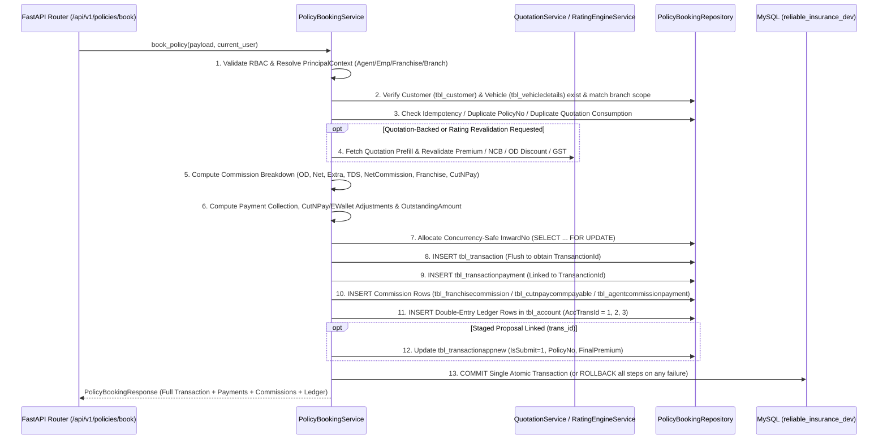

# Phase 7 — Policy Booking & Transaction Engine: Stored Procedure & Table Mapping

**Phase:** 7 — Policy Booking & Transaction Engine  
**Stage:** A2 — Stored Procedure to Repository/Service Mapping  
**Target Database:** `localhost:3306/reliable_insurance_dev`

---

## 1. Master Stored Procedure Mapping Table

| # | Legacy Stored Procedure | Legacy Caller (`*.aspx.cs` / `Service.asmx.cs`) | Operation | Target Table(s) | FastAPI Service / Repository Method | Parity & Modernization Notes |
|---:|---|---|---|---|---|---|
| 1 | `sp_getDataForPolicyEntry` | `Service.asmx.cs::getDataForPolicyEntry`, `PolicyTransactionNew.aspx.cs` | `SELECT` | `tbl_app_quatationentry`, `tbl_app_quotationrequest`, `tbl_insurancecompanyquotation` | `QuotationService.get_policy_prefill` / `PolicyBookingService.resolve_quotation_for_booking` | Branches on `P_Command = 'SELFQUO'` (`SRQ...`) vs Assisted Request (`QR...`). Reuses Phase 6 prefill contract. |
| 2 | `Sp_InsertAppTransctiondetailsNew8` / `sp_InsertAppTransactionNew` | `Service.asmx.cs::InsertAppTransactionNew` | `INSERT` | `tbl_transactionappnew` | `PolicyBookingService.create_proposal` -> `PolicyBookingRepository.create_proposal` | Inserts staged mobile/partner proposal (`TransId`), sets initial approval flags (`IsOwnerApprove`, `IsChashierApprove`, `IsAccountApproval`, `IsSubmit`). |
| 3 | `sp_generateInwardNo` | `PolicyTransactionNew.aspx.cs`, `PE_TransactionEntry.aspx.cs` | `SELECT` | `tbl_transaction`, `tbl_branch` | `PolicyBookingRepository.allocate_inward_no` | Acquires branch row lock (`FOR UPDATE`) and generates sequential `InwardNo` scoped by `BranchId` and `FinancialYear`. |
| 4 | `sp_InsertTransactionNew_2026` / `sp_InsertPolicyTransactionEntry` | `PolicyTransactionNew.aspx.cs`, `PE_TransactionEntry.aspx.cs` | `INSERT` | `tbl_transaction` | `PolicyBookingService.book_policy` -> `PolicyBookingRepository.create_transaction` | Persists 166-column underwriting record (`TransanctionId`), preserving `ODPermium`, `TPPermium`, `NetPermium`, `NCBPermium`, `GST_Amount`, `Amount`, `CutNPay`, etc. |
| 5 | `sp_UpdateTransactionNew_2026` / `sp_UpdatePolicyTransactionEntry` | `PolicyTransactionNew.aspx.cs`, `PE_TransactionEntry.aspx.cs` | `UPDATE` | `tbl_transaction` | `PolicyBookingService.update_policy` -> `PolicyBookingRepository.update_transaction` | Updates policy number (`PolicyNo`), dates (`CnIssueDate`, `RiskStartdate`, `ExpiryDate`), status (`TStatus`), and recalculates commission/accounting if financials change. |
| 6 | `sp_InsertTransactionPayment` | `PolicyTransactionNew.aspx.cs`, `PE_TransactionEntry.aspx.cs` | `INSERT` | `tbl_transactionpayment` | `PolicyBookingService.record_payment` -> `PolicyBookingRepository.create_payment` | Inserts payment instrument row (`PaymentId`) linked via `TransanctionId` and updates `PaidAmount`, `OutstandingAmount`, `isCompletePayment`. |
| 7 | `sp_InsertAccountDetails` | `PolicyTransactionNew.aspx.cs`, `AgentCommisionApproval.aspx.cs` | `INSERT` | `tbl_account`, `tbl_ledgermaster` | `PolicyBookingRepository.create_accounting_entries` | Inserts double-entry ledger rows (`AccTransId = 1` Premium Receivable, `AccTransId = 2` Payment Receipt, `AccTransId = 3` Unclear Policy Commission with `-NetCommission`). |
| 8 | `sp_InsertFranchiseCommission` (inline / DAL) | `PolicyTransactionNew.aspx.cs` | `INSERT` | `tbl_franchisecommission` | `PolicyBookingRepository.create_franchise_commission` | Records franchise commission split (`ODPer`, `ODAmt`, `NetPer`, `NetAmt`, `ExtraPer`, `ExtraAmt`, `TDSPer`, `TDSAmt`, `TotalCommAmt`, `NetCommAmt`). |
| 9 | `sp_InsertCutNPayCommPayable` (inline / DAL) | `PolicyTransactionNew.aspx.cs` | `INSERT` | `tbl_cutnpaycommpayable` | `PolicyBookingRepository.create_cutnpay_payable` | Records Cut & Pay commission deduction (`PolicyPremium`, `PayableCommAmt`, `PaidAmt`, `RemainingAmt`, `TransactionType`) when `CutNPay = 1`. |
| 10 | `sp_InsertAgentCommissionPayment` | `AgentCommisionApproval.aspx.cs`, `PolicyTransactionNew.aspx.cs` | `INSERT` | `tbl_agentcommissionpayment` | `PolicyBookingRepository.create_agent_commission_payment` | Records agent commission settlement / accrual tracking row linked to `AgentId` and `BranchId`. |
| 11 | `sp_UpdateCashierApproval` | `CashierApprovalNew.aspx.cs` | `UPDATE` | `tbl_transactionappnew`, `tbl_transaction` | `PolicyBookingService.approve_proposal` (`approval_stage="CASHIER"`) | Sets `IsChashierApprove = 1`, `ChashierApproveDate = NOW()`, `CashierId = current_user.UserId`. |
| 12 | `sp_UpdateAccountantApproval` | `AccountantApproval.aspx.cs` | `UPDATE` | `tbl_transactionappnew`, `tbl_transaction` | `PolicyBookingService.approve_proposal` (`approval_stage="ACCOUNTANT"`) | Sets `IsAccountApproval = 1`, `AccountApprovalDate = NOW()`. |
| 13 | `sp_UpdateOwnerApproval` | `OwnerApproval.aspx.cs` | `UPDATE` | `tbl_transactionappnew`, `tbl_transaction` | `PolicyBookingService.approve_proposal` (`approval_stage="OWNER"`) | Sets `IsOwnerApprove = 1`, `OwnerApprovalDate = NOW()`. |
| 14 | `sp_DeleteTransactionByTransId` / `sp_DeleteTransactionEntryByTransId` | `adm_DeletePolicyTransaction.aspx.cs`, `adm_DeleteTransactionEntry.aspx.cs` | `UPDATE` (Soft Delete) | `tbl_transaction`, `tbl_transactionpayment`, `tbl_account`, `tbl_franchisecommission` | `PolicyBookingService.cancel_policy` | Sets `tbl_transaction.isdeleted = 1`, `TStatus = 'Cancelled'`, `tbl_transactionpayment.deleted = 1`, `tbl_account.deleted = 1`, `tbl_franchisecommission.isdeleted = 1`. |
| 15 | `sp_SelectTransactionById` / `sp_SelectTransactionByFilter` | `PolicyTransactionNew.aspx.cs`, `Adm_AllTransactionExport.aspx.cs` | `SELECT` | `tbl_transaction`, `tbl_transactionpayment`, `tbl_account` | `PolicyBookingService.get_policy`, `PolicyBookingService.list_policies` | Enforces branch, franchise, sales executive, and agent ownership filters. |

---

## 2. Deterministic Execution Order During Policy Booking (`POST /api/v1/policies/book`)

---

## 3. Column-Level Mapping: `tbl_transaction` (`Transaction` ORM Model)

| Business Field | Physical Column in `tbl_transaction` | SQL Type | Source / Computation Rule |
|---|---|---|---|
| Transaction Primary Key | `TransanctionId` | `INT AUTO_INCREMENT` | Generated by MySQL on flush |
| Inward Number | `InwardNo` | `VARCHAR(45)` | Generated by `allocate_inward_no(branch_id, financial_year)` |
| Transaction Date | `TransDate` | `DATE` | `payload.trans_date` or `date.today()` |
| Branch ID | `BranchId` | `INT` | Server-resolved `current_user.BranchId` (or explicit `branch_id` for Global Admin) |
| Customer ID | `CustomerId` | `INT` | Verified `tbl_customer.CustomerId` |
| Customer Vehicle ID | `CustVehId` | `INT` | Verified `tbl_vehicledetails.CustVehId` |
| Underwriting Insurer | `InsuranceCompanyId` | `INT` | Verified `tbl_insurancecompany.InsuranceCompanyId` |
| Policy Type ID | `PolicyTypeId` | `INT` | `1`=Package/Comprehensive, `2`=TP Only, `3`=Standalone OD |
| Product Type ID | `ProductTypeId` | `INT` | `1`=Comprehensive, `2`=Liability Only (STP), `3`=SAOD |
| Business Type ID | `BusinessTypeId` | `INT` | `1`=New, `2`=Renewal, `3`=Roll Over, `4`=Used/Endorsement |
| Policy Number | `PolicyNo` | `VARCHAR(45)` | `payload.policy_no` (unique per active insurer when issued) |
| Cover Note / Issue Date | `CnIssueDate` | `DATE` | `payload.cn_issue_date` or `trans_date` |
| Risk Start Date | `RiskStartdate` | `DATE` | `payload.risk_start_date` |
| Policy Expiry Date | `ExpiryDate` | `DATE` | `payload.expiry_date` (`RiskStartdate + 1 year - 1 day`) |
| Due Date | `DeuDate` | `DATE` | Matches `ExpiryDate` |
| Insured Declared Value (IDV) | `SumInsured` | `DOUBLE` (`Decimal`) | Total IDV (`selected_idv + accessories`) |
| Gross Vehicle Weight | `GVW` | `DOUBLE` (`Decimal`) | Vehicle GVW in kg (`0` for non-GCV) |
| IMT-23 Loading | `Imt23` | `DOUBLE` (`Decimal`) | IMT-23 loading amount (`15%` of gross OD for GCV) |
| Nil-Dep / Add-On Flag & Rate | `IsNill`, `AddOnRate`, `AddOn` | `INT`, `DOUBLE`, `DOUBLE` | `1` if Zero-Dep active else `0`; rate %; monetary `zero_dep_premium` |
| Towing / RSA | `TowingChargesAmt`, `RoadSidePremium` | `DOUBLE` (`Decimal`) | Monetary towing and roadside assistance premiums |
| NCB Percentage & Amount | `NCB`, `NCBPer`, `NCBPermium` | `DOUBLE`, `INT`, `DOUBLE` | NCB slab (`0, 20, 25, 35, 45, 50`) and monetary `ncb_amount` |
| OD Discount Percentage | `ODDiscount` | `DOUBLE` (`Decimal`) | Company OD discount percentage (`0`–`100`) |
| Own Damage Premium | `ODPermium` | `DOUBLE` (`Decimal`) | Net OD premium including add-ons (`total_od_with_addons`) |
| Third-Party Premium | `TPPermium` | `DOUBLE` (`Decimal`) | Total TP liability premium (`total_tp_premium`) |
| PA & LL Sub-Limits | `PACovertoOwner`, `PACoverDriverCleaner`, `LegalLiabilitytoPaidDriver` | `DOUBLE` (`Decimal`) | Individual TP cover components |
| Net Premium (Before GST) | `NetPermium` | `DOUBLE` (`Decimal`) | `ODPermium + TPPermium` |
| GST Amount | `GST_Amount` | `DOUBLE` (`Decimal`) | Total GST (`18%` or split `12%` Basic TP + `18%` OD/Add-On for GCV) |
| Final Payable Premium | `Amount`, `ProPosalAmt` | `DOUBLE` (`Decimal`) | `NetPermium + GST_Amount` |
| Agent Commission (Total) | `AgentComm`, `AgentCommAmt`, `TdsAmt`, `NetCommission` | `DOUBLE` (`Decimal`) | Aggregate commission %, gross amount, TDS deduction, and net commission |
| Agent Commission (OD / Net / Extra) | `AgentComm_OD`, `AgentCommAmt_OD`, `TdsAmt_OD`, `NetCommission_OD`, `AgentComm_Net`, `AgentCommAmt_Net`, `TdsAmt_Net`, `NetCommission_Net`, `AgentComm_Extra`, `AgentCommAmt_Extra`, `TdsAmt_Extra`, `NetCommission_Extra` | `DOUBLE` (`Decimal`) | Component-level commission breakdown |
| TDS Percentage | `tdsPercent` | `DOUBLE` (`Decimal`) | TDS rate (`5.00%` standard legacy default or configured rate) |
| Cut & Pay Indicator | `CutNPay` | `INT` | `1` if Cut & Pay deduction applied, `0` otherwise |
| E-Wallet Amount Used | `EWalletAmountUsed` | `DOUBLE` (`Decimal`) | Amount deducted from agent/franchise e-wallet |
| Paid & Outstanding Amounts | `PaidAmount`, `OutstandingAmount` | `DOUBLE` (`Decimal`) | Collected amount vs remaining payable balance |
| Underwriting & Pending Status | `TStatus`, `pendingStatus` | `VARCHAR(45)`, `VARCHAR(100)` | `"Booked"` / `"Issued"` / `"Pending"` / `"Cancelled"` |
| Quotation & Proposal Links | `QuatationCode`, `TransId` | `VARCHAR(100)`, `INT` | Traceability to Phase 6 quotation and staged proposal |
| Ownership Identifiers | `AgentId`, `SalesEx_id`, `FranchiseCode`, `LocationHeadId` | `INT`, `INT`, `VARCHAR(45)`, `INT` | Server-resolved or validated hierarchy ownership |
| Financial Year | `FinancialYear` | `VARCHAR(45)` | e.g., `"2026-2027"` |
| Audit Fields | `CreationDate`, `UpdationDate`, `UpdateUser`, `isdeleted` | `DATETIME`, `DATETIME`, `VARCHAR(45)`, `TINYINT(1)` | Creation/modification timestamps and actor ID |
