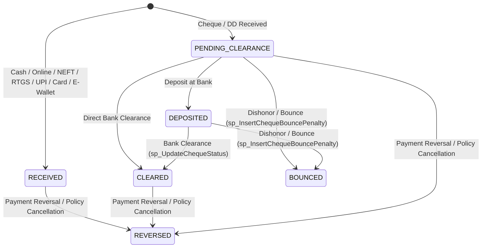

# Phase 8 — Payment State Machine & Instrument Rules

**Repository**: `Reliable-Insurance-Backend`  
**Phase**: `Phase 8 — Payments, Cheques & Reconciliation Engine (Stage A3)`  
**Target Runtime Database**: `localhost:3306/reliable_insurance_dev`

---

## 1. Payment Instrument State Machine (`tbl_transactionpayment`)

Each payment instrument row in `tbl_transactionpayment` carries its lifecycle state in `Extra1` (status string), `isdeleted` (`"0"` active vs `"1"` reversed/bounced), `CashierApproval`, `AccountantApproval`, `OwnerApproval`, and parent `tbl_transaction` cheque flags (`Ischequeclearing`, `IsChequeCleared`, `ChequeBankStatus`).

---

## 2. State Transition Table

| Current State (`Extra1`) | Allowed Action | Next State (`Extra1`) | Allowed Roles | Financial Effect on `tbl_transaction` | Ledger Effect on `tbl_account` |
|---|---|---|---|---|---|
| *(New)* | Create Cash / NEFT / RTGS / UPI / Online / Card / E-Wallet Payment | `RECEIVED` | `POLICY_PAYMENT_WRITE_ROLES` / `POLICY_BOOKING_WRITE_ROLES` | `PaidAmount += amt`, `OutstandingAmount -= amt`; if `OutstandingAmount == 0` and no uncleared cheques: `TStatus = "Booked"`, `pendingStatus = 0` | Inserts `AccTransId = 2` (`+amt`, `Extra1 = "POLICY_PAYMENT"`); if `EWALLET`, also debits wallet (`AccTransId = 13`, `-amt`) |
| *(New)* | Create Cheque / DD Payment | `PENDING_CLEARANCE` | `POLICY_PAYMENT_WRITE_ROLES` / `POLICY_BOOKING_WRITE_ROLES` | `PaidAmount += amt`, `OutstandingAmount -= amt`, `Ischequeclearing = 1`, `IsChequeCleared = 0`, `ChequeBankStatus = 0` | Inserts `AccTransId = 2` (`+amt`, `Extra1 = "POLICY_PAYMENT"`) |
| `PENDING_CLEARANCE` | Deposit Cheque (`POST /payments/{id}/deposit`) | `DEPOSITED` | `CASHIER`, `ACCOUNT`, `ACCOUNT HEAD`, `ADMIN`, `OWNER`, `OPERATOR` | `Ischequeclearing = 1`, `IsChequeCleared = 0`, `ChequeBankStatus = 0` | Updates `CashierApproval = 1`, `CashierApprovalDate = NOW()` |
| `PENDING_CLEARANCE` or `DEPOSITED` | Clear Cheque (`POST /payments/{id}/clear`) | `CLEARED` | `ACCOUNT`, `ACCOUNT HEAD`, `CASHIER`, `ADMIN`, `OWNER`, `IT SUPPORT` | `Ischequeclearing = 0`, `IsChequeCleared = 1`, `ChequeBankStatus = 1`, `CheqBankDate = clear_date`; if `OutstandingAmount == 0`: `TStatus = "Booked"`, `pendingStatus = 0` | Confirms `AccTransId = 2` receipt (`AccountantApproval = 1`); no duplicate `+amt` posted |
| `PENDING_CLEARANCE` or `DEPOSITED` | Bounce Cheque (`POST /payments/{id}/bounce`) | `BOUNCED` (`isdeleted = "1"`) | `ACCOUNT`, `ACCOUNT HEAD`, `ADMIN`, `OWNER`, `IT SUPPORT` | `PaidAmount -= amt`, `OutstandingAmount += amt + penalty`, `Ischequeclearing = 0`, `IsChequeCleared = 0`, `ChequeBankStatus = 2`, `CheqBankDate = bounce_date`, `TStatus = "Pending"`, `pendingStatus = 1` | Posts contra `AccTransId = 2` (`-amt`, `"CHEQUE_BOUNCE_REVERSAL"`) + if `penalty > 0`, posts `AccTransId = 4` (`+penalty`, `"CHEQUE_BOUNCE_PENALTY"`) |
| `RECEIVED`, `PENDING_CLEARANCE`, `DEPOSITED`, or `CLEARED` | Reverse Payment (`POST /payments/{id}/reverse`) | `REVERSED` (`isdeleted = "1"`) | `ADMIN`, `OWNER`, `ACCOUNT`, `ACCOUNT HEAD`, `BRANCH MANAGER` | `PaidAmount -= amt`, `OutstandingAmount += amt`; if `OutstandingAmount > 0`: `TStatus = "Pending"`, `pendingStatus = 1` | Posts contra `AccTransId = 2` (`-amt`, `"PAYMENT_REVERSAL"`); if `EWALLET`, credits wallet (`AccTransId = 14`, `+amt`, `"WALLET_REFUND"`) |
| `BOUNCED` or `REVERSED` | Any Mutating Action (`clear`, `bounce`, `reverse`) | **Rejected (`409 Conflict`)** | None | None (Immutable terminal state; replacement payment must be recorded as a new instrument row) | None |

---

## 3. Supported Payment Instrument Rules Matrix

| `PaymentType` | Required Fields | Optional Fields | Initial Status (`Extra1`) | `CashierApproval` Default | Cheque Clearing Flags (`Ischequeclearing`, `IsChequeCleared`) | Special Validation & Side Effects |
|---|---|---|---|---|---|---|
| `CASH` | `paid_amount > 0` | `payment_date`, `payment_details`, `docno` | `RECEIVED` | `1` | `(0, 1)` | Immediate settlement toward `PaidAmount`. |
| `CHEQUE` | `paid_amount > 0`, `docno` (Cheque No), `bankname` | `payment_date` (Cheque Date), `payment_details`, `bank_branch` | `PENDING_CLEARANCE` | `0` | `(1, 0)` | Rejects with `422` if `docno` or `bankname` is blank. Requires clearance (`POST /payments/{id}/clear`) to set `IsChequeCleared = 1`. |
| `DD` | `paid_amount > 0`, `docno` (DD No), `bankname` | `payment_date`, `payment_details`, `bank_branch` | `PENDING_CLEARANCE` | `0` | `(1, 0)` | Rejects with `422` if `docno` or `bankname` is blank. Follows bank clearance lifecycle. |
| `NEFT` | `paid_amount > 0`, `docno` (UTR) | `bankname`, `payment_date`, `payment_details` | `RECEIVED` | `1` | `(0, 1)` | Rejects with `422` if `docno` (UTR) is blank in strict Phase 8 payment endpoints (or defaults to reference if provided via booking). |
| `RTGS` | `paid_amount > 0`, `docno` (UTR) | `bankname`, `payment_date`, `payment_details` | `RECEIVED` | `1` | `(0, 1)` | Electronic bank transfer; immediate settlement. |
| `UPI` | `paid_amount > 0`, `docno` (UPI Ref / RRN) | `bankname`, `payment_date`, `payment_details` | `RECEIVED` | `1` | `(0, 1)` | Instant UPI receipt. |
| `ONLINE` | `paid_amount > 0` | `docno`, `bankname`, `payment_date`, `payment_details` | `RECEIVED` | `1` | `(0, 1)` | Portal / payment gateway receipt. |
| `CREDIT_CARD` | `paid_amount > 0` | `docno`, `bankname`, `payment_date`, `payment_details` | `RECEIVED` | `1` | `(0, 1)` | POS / gateway card receipt. |
| `DEBIT_CARD` | `paid_amount > 0` | `docno`, `bankname`, `payment_date`, `payment_details` | `RECEIVED` | `1` | `(0, 1)` | POS / gateway card receipt. |
| `EWALLET` | `paid_amount > 0` | `wallet_owner_id`, `lock_id`, `docno`, `payment_details` | `RECEIVED` | `1` | `(0, 1)` | Atomically consumes an active wallet lock (`lock_id`) or debits the Agent/Franchise E-Wallet under `FOR UPDATE` row lock (`422` if insufficient balance). |
